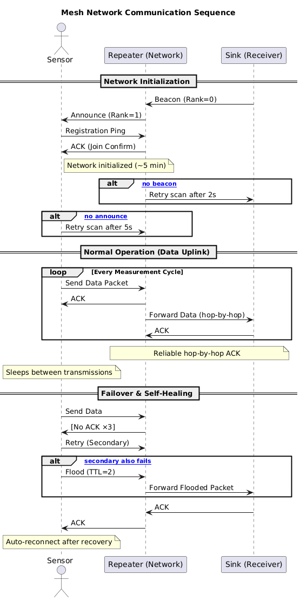

# 🌐 Mesh Network Communication Sequence

This project implements a **LoRa-based Mesh Network** consisting of **Sensor**, **Repeater**, and **Receiver (Sink)** nodes for environmental data transmission.  
The system is designed to operate reliably across large greenhouse environments with metal supports and signal interference, using **RadioLib** for communication and self-healing mesh logic.

---

## 📖 Overview

The network allows multiple sensor nodes to collect environmental data (temperature, humidity, light intensity, soil conditions) and send it to a central receiver via one or more repeaters.  
The system emphasizes **robustness**, **low power operation**, and **self-recovery** through beacon-based discovery, ACK-driven data delivery, and failover flooding.

---

## ⚙️ Architecture

Each node in the network operates with specific roles:

| Node Type | Description |
|------------|-------------|
| **Sensor** | Collects environmental data and transmits it periodically. Handles join requests, beacon scanning, and ACK-based retransmission. |
| **Repeater** | Acts as a network relay between sensors and the sink. Broadcasts beacons, registers sensors, forwards packets, and handles ACK propagation. |
| **Sink (Receiver)** | The final destination that collects data and acknowledges successful transmissions. Runs on a Raspberry Pi using C++ and RadioLib. |

Communication is divided into three main stages:
1. **Network Initialization** – Nodes announce themselves and join the mesh.
2. **Normal Operation (Data Uplink)** – Periodic sensor data transmission with hop-by-hop ACKs.
3. **Failover & Self-Healing** – Flood-based retransmission when the normal path fails.

---

## 🧩 Project Structure
.
├── README.md
├── reciver
│   ├── CMakeList.txt
│   └── reciver.cpp
├── repeter
│   └── repeter.ino
├── sensor
│   └── sensor.ino
└── UMLdiagram.png

---

## 🧠 UML Communication Sequence

Below is the UML diagram representing the **Mesh Network Communication Sequence** used by the system:

---

## 🔧 Key Features

- **Automatic Discovery:** Sensors detect beacons from repeaters and register automatically.  
- **Reliable Hop-by-Hop ACK:** Ensures confirmed delivery at every hop.  
- **Self-Healing Flooding Mechanism:** Recovers from lost ACKs or repeater failures.  
- **Modular Design:** Independent source files for each node type.  
- **Lightweight Protocol:** Minimal packet overhead for embedded systems.  
- **Extensive Logging:** UART debug output for each communication step.  
